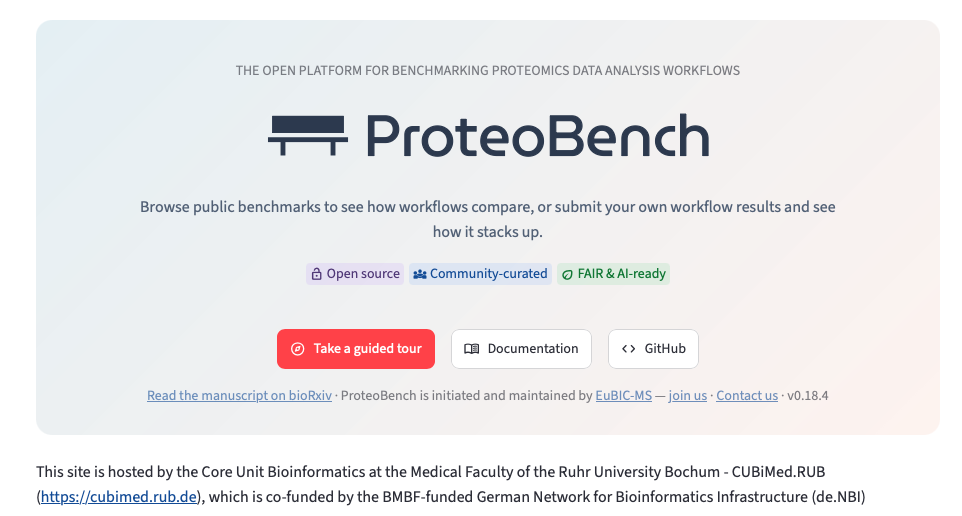
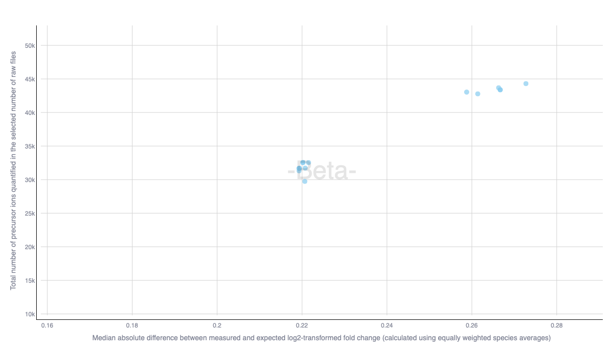

## ProteoBench

[ProteoBench](https://proteobench.cubimed.rub.de/) is an open platform for benchmarking software tools dedicated to proteomics data analysis. Its source code is available on [GitHub](https://github.com/Proteobench/ProteoBench), and the materials associated to this workshope are available [here](https://github.com/Proteobench/Educational_resources).

## Learning objectives

The aim of this workshop is to guide the free exploration of ProteoBench with questions designed to kick off discussions.

## Pre-requisites

We recommend to follow the self-guided tour of ProteoBench before the workshop. It is available on the ProteoBench home page (red button in the screenshot below):

## Questions

### Warm up

**Q1.** How many ProteoBench modules are based on data-dependent acquisition (DDA) data?

**Q2.** To make a workflow output public, users have to provide a parameter of log file. Why is this important?

### Module Quant LFQ DDA ion QExactive

In the module [Quant LFQ DDA ion QExactive](https://proteobench.cubimed.rub.de/Quant_LFQ_DDA_ion_QExactive), we can see two groups of points corresponding to MaxQuant runs. 

**Q3.** In these two groups of points, is there a difference in number of precursor ions quantified in 1 or more runs? 

**Q4.** Can you find what is the main parameter responsible for this separation?

Find the points `MaxQuant_20250605_123112` and `MaxQuant_20250605_121216`. These have the same set of parameter, except our mysterious parameter responsible for the two clusters of workflow outputs in Figure 2. Go to the tab `Compare Two Results`, and select these two points.

**Q5.** Do the two MaxQuant runs contain the same set of precursor ions? If not, how can you explain the increase of quantification error in `MaxQuant_20250605_123112`?

:::{.callout-note collapse="true" title = "Going deeper"}
To explore in depth the differences between the workflow runs `MaxQuant_20250605_123112` and `MaxQuant_20250605_121216`, you can go to the tab `View Single Result`, and select one run. ProteoBench will generate in-depth plots that will help you to identify reasons for performance differences.
:::

### Module Entrapment DIA ion Astral

The module [Entrapment DIA ion Astral](https://proteobench.cubimed.rub.de/Entrapment_DIA_ion_Astral) is designed to evaluate the ability of the software tools to estimate the false discovery proportion (FDP) in DIA data acquired on an Astral instrument.

**Q6.** What does allow us to estimate the proportion of incorrect identifications in these data? Tip: it is in the FASTA.

**Q7.** Would the results of this module be the same if the data used as workflow input were generated with a timsTOF?

### Other modules

**Q8.** Does a high number of quantified precursor ions in the "Quant LFQ" modules mean that the precursor ions are correctly identified?

**Q9.** Why are some modules archived? What does this mean?

**Q10.** What type of data is not present in any ProteoBench module and would be of interest to you?

**Q11.** What is the difference between "ALPHA" and "BETA" modules?

## Let us know

If you think of questions to add to this workshop, or if you think that we can improve it in any way, please let us know by opening a github issue [here](https://github.com/Proteobench/Educational_resources/issues/new), or sending us an [email](mailto:proteobench@eubic-ms.org)

---------
#### Contact us

You can contact us by [email](mailto:proteobench@eubic-ms.org), and contribute to public discussions (propose a new module, report issues, or suggest improvements) [here](https://github.com/orgs/Proteobench/discussions).

#### Supporting video

*Coming soon!*

#### Supporting literature

*ProteoBench: the community-curated platform for comparing proteomics data analysis workflows*
Robbe Devreese, Caroline Jachmann, Bart Van Puyvelde, Holda A. Anagho-Mattanovich, Witold E. Wolski, Henry Webel, Matthias Anagho-Mattanovich, Wout Bittremieux, Karima Chaoui, Cristina Chiva, Tine Claeys, Hector Mauricio Castaneda Cortes, Simon Devos, Maarten Dhaenens, Nadezhda T. Doncheva, Viktoria Dorfer, Martin Eisenacher, Ralf Gabriels, Quentin Giai Gianetto, David M. Hollenstein, Lars Juhl Jensen, Vedran Kasalica, Olivier Langella, Caroline Lennartsson, Dominik Lux, Lennart Martens, Mariette Matondo, Teresa Mendes Maia, Emmanuelle Mouton-Barbosa, Alireza Nameni, Michael Lund Nielsen, Jesper Velgaard Olsen, Magnus Palmblad, Christian Panse, Yasset Perez-Riverol, Marina Pominova, Martin Rykær, Eduard Sabidó, Julia Schessner, Martin Schneider, Veit Schwämmle, An Staes, Maximilian T. Strauss, Tim Van Den Bossche, Sam Van Puyenbroeck, Kevin Velghe, Runxuan Zhang, Julian Uszkoreit, Robbin Bouwmeester, Marie Locard-Paulet
bioRxiv 2025.12.09.692895; doi: https://doi.org/10.64898/2025.12.09.692895

